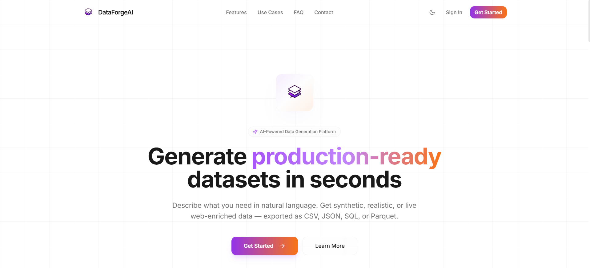

<div align="center">

# ⚙️ DataForgeAI Backend

**FastAPI · AI Dataset Generation · Analytics Engine**

[](https://fastapi.tiangolo.com/)
[](https://www.python.org/)
[](https://www.postgresql.org/)
[](https://redis.io/)
[](https://pandas.pydata.org/)

<br />

🎥 [Demo 1](https://youtu.be/BG-SnTXXucQ) · 🎥 [Demo 2](https://youtu.be/JZllTuYlBQk) · 📝 [Kaggle Writeup](https://www.kaggle.com/writeups/ameyac11/dataforgeai) · 🔗 [DOI](https://doi.org/10.34740/kaggle/w/86627)

<br />

### 📸 Preview

<table align="center">
  <tr>
    <td align="center" width="50%">
      <a href="https://youtu.be/JZllTuYlBQk">
        
      </a>
      <br />
      <sub><b>🏠 Landing Page</b> · <a href="https://youtu.be/BG-SnTXXucQ">Watch Demo</a></sub>
    </td>
    <td align="center" width="50%">
      <a href="https://youtu.be/JZllTuYlBQk">
        
      </a>
      <br />
      <sub><b>💬 DataNest Chat</b> · <a href="https://youtu.be/JZllTuYlBQk">Watch Demo</a></sub>
    </td>
  </tr>
</table>

</div>

<br />

The core API for **DataForgeAI** — conversational dataset generation, custom schema-based generation, analytics, and secure auth. Pair it with the [Frontend](https://github.com/ameyac11/DataForgeAI_Frontend) for the full user experience.

---

## 🔗 Related Repository

| Repo | Description |
|:---|:---|
| 🌟 [**DataForgeAI Frontend**](https://github.com/ameyac11/DataForgeAI_Frontend) | React SPA — chat UI, analytics workspace, dataset library |

---

## ✨ Features

- 💬 **DataNest Chat** — Conversational dataset design with SSE streaming
- 🧬 **Custom Generator** — Schema-based generation with AI column suggestions
- 📊 **Analytics Engine** — Distributions, correlations, outliers, time series & what-if simulation
- 📄 **PDF Reports** — Branded analytics report export
- 🤖 **Multi-LLM** — Groq · GitHub Models (8 model options with smart routing)
- 📁 **Dataset Storage** — Appwrite cloud + local fallback
- 🔐 **Secure Auth** — JWT HttpOnly cookies · Google & GitHub OAuth
- 🚦 **Rate Limiting** — Redis-backed per-endpoint protection
- 📈 **Usage Tracking** — Per-user limits and quota monitoring

---

## 🛠️ Tech Stack

| | |
|:---:|:---|
| ⚡ | **FastAPI** · Uvicorn · Pydantic |
| 🐘 | **PostgreSQL** · SQLAlchemy |
| 🚀 | **Redis** — cache, sessions & rate limits |
| 🔐 | **JWT** · OAuth 2.0 · Appwrite |
| 🤖 | **Groq** · GitHub Models (Azure AI Inference) |
| 📊 | **pandas** · numpy · matplotlib · seaborn · reportlab |

---

## 📋 Prerequisites

- **Python** 3.10+
- **PostgreSQL** and **Redis** running locally (or remote instances)
- API keys for at least one LLM provider (Groq and/or GitHub Models)
- Optional: [Appwrite](https://appwrite.io/) project for cloud dataset storage

---

## 🚀 Quick Start

```bash
git clone https://github.com/ameyac11/DataForgeAI_Backend.git
cd DataForgeAI_Backend

python -m venv .venv
.venv\Scripts\activate          # Windows
# source .venv/bin/activate     # macOS / Linux

pip install -r requirements.txt
cp .env.example .env            # fill in database, Redis, JWT, and LLM keys
uvicorn main:app --reload
```

🌐 API → `http://localhost:8000`  
📖 Docs → [`/docs`](http://localhost:8000/docs) · [`/redoc`](http://localhost:8000/redoc)

### Environment Variables

Copy `.env.example` and configure:

| Group | Key variables |
|:---|:---|
| **Database** | `DATABASE_HOST`, `DATABASE_PORT`, `DATABASE_NAME`, `DATABASE_USER`, `DATABASE_PASSWORD` |
| **Redis** | `REDIS_HOST`, `REDIS_PORT`, `REDIS_PASSWORD` |
| **Auth** | `JWT_SECRET`, OAuth client IDs/secrets for Google & GitHub |
| **URLs** | `FRONTEND_URL`, `BACKEND_URL` |
| **LLM** | `GROQ_API_KEY`, `GITHUB_TOKEN` |
| **Storage** | Appwrite `APPWRITE_*` keys (optional — falls back to local storage) |

---

## 📁 Project Structure

```
├── main.py           # FastAPI app entry point
├── api/              # Route handlers (auth, chat, analytics, datasets)
├── analytics/        # Analytics engine & PDF report generation
├── auth/             # JWT & OAuth helpers
├── database/         # SQLAlchemy models & DB setup
├── generator/        # Dataset generation engine
├── llm/              # Groq & GitHub Models providers
├── rate_limit/       # Redis-backed rate limiting
└── final_prompt/     # Prompt building for chat & generation
```

---

## 🌟 Support

If you find this project useful or interesting, please consider giving it a ⭐ on GitHub! Your support helps make the project more visible and encourages further development.

---

## 📜 License

[](./LICENSE)

Licensed under the **GNU Affero General Public License v3.0 (AGPL-3.0)**.  
Copyright © 2026 Ameya Sanjay Chopade · See [LICENSE](./LICENSE) for details.
